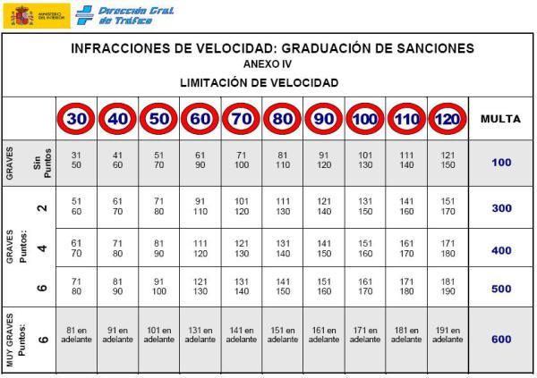

# Activitat 6. Atenció als ràdars

L'objectiu d'aquesta pràctica és consolidar els coneixements relatius als constructors i la sobrecàrrega de mètodes i constructors.

Partim d'un projecte parcialment implementat i que trobareu en aquest dipòsit. No heu d'esborrar el que està implementat, ho heu d'aprofitar.

Aquesta aplicació serveix per controlar la velocitat dels vehicles en diferents trams de carretera i aplicar les sancions que calguin.

Com veieu disposeu d'una classe anomenada Infraccio que ha de tenir la següent informació: límit de velocitat del tram, interval de velocitats de pas, import a pagar per circular a una velocitat dintre de l'interval de velocitats per a aquest límit de velocitat i punts a detreure en el mateix supòsit.

A continuació es mostra una taula per ajudar a entendre els conceptes.

Implementa la classe Infraccio definint els atributs que creguis necessari i tenim en compte que una infracció s'ha d'instanciar amb paràmetres per inicialitzar tots els atributs o tots els atributs tret del valor superior de la velocitat de pas. També haureu d'implementar tots els mètodes get dels atributs.

De la classe RegistreInfraccions heu d'implementar els següents mètodes (a banda del constructor):

**afegirInfraccio**: Donada una infracció l'afegeix al registre d'infraccions si aquesta no està registrada.

**importSancionarVehicle**: Aquest mètode es pot cridar de dues maneres:

- En la primera manera té com a paràmetres dos enters representant el límit de velocitat d'un tram de carretera i la velocitat a la qual circula un vehicle per aquest tram. S'ha de cercar en el registre d'infraccions per veure si aquest vehicle se'l pot sancionar. Al vehicle se'l sancionarà si per al límit donat existeix una infracció amb aquest límit de
velocitat i la velocitat a la qual circula el vehicle està entre els dos valors de la velocitat de pas de la infracció (inclosos els dos valors de la velocitat de pas). Si al vehicle se'l pot sancionar es retorna l'import de la infracció que ha comés i 0 si no se'l pot sancionar.

- En la segona manera es passen com a paràmetres dos vectors i un enter representant la mida d'aquests vectors (tenen la mateixa mida). En el primer vector cada casella conté el límit de velocitat d'un tram de carretera i en la casella homòloga del segon vector tindrem la velocitat a la qual circula el vehicle per aquest tram. El mètode calcularà l'import de la sanció acumulant totes les sancions de tots els trams (cada casella dels vectors representa un tram).

**puntsSancionarVehicle**: Aquest mètode és totalment anàleg a l'anterior però el valor a retornar són els punts a detreure.
De la classe de prova (TestInfraccio) heu d'implementar el mètode main (programa principal) carregant prèviament el registre d'infraccions amb el mètode que us donem.

L'execució de l'aplicació ha de produir una sortida semblant a la mostrada (no té perquè ser igual).

    Infracció vehicle 1
    ----------------------
    Import de la sanció: 300 €
    Punts a detreure: 2 punts
    
    Infracció vehicle 2
    ----------------------
    El vehicle 2 no ha comès cap infracció
    
    
    Infracció vehicle 3
    ----------------------
    Import de la sanció: 1000 €
    Punts a detreure: 8 punts
